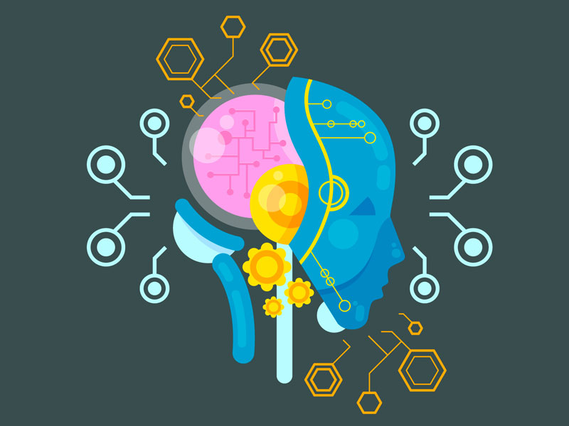

 
The above image is the graphical represenataion how each of them is classified lets dive deeper into this.

**<h5>What is Artifical intelligence ?</h5>**

> The invention of AI traced back to `John McCarthy` who is the founding father along with `Marvin Minskey`, `AllenNewell` and `Herbert A`. `Simon. McCarthy` coined the term “Artificial intelligence” in 1955.
								

* <strong style="color:#fb5607">Artifical intelligence</strong> is a broad branch of computer science .The main goal of artificial intelligence is to implement intelligence in machines which tends to develop systems which can understand, think, learn and behave like humans.
  * <strong style="color:#48cae4">Humans</strong> can speak and listen to communicate through languages this is the field of speech recognition.
  * <strong style="color:#48cae4">Humans</strong> can write and read text in a language this is the field of NLP i.e Natural Language Processing.
  * <strong style="color:#48cae4">Humans</strong> can write and read text in a language this is the field of NLP i.e Natural Language Processing.
  * <strong style="color:#48cae4">Humans</strong> can see with their eyes and process what they see. This is the field of Computer Vision.
  * <strong style="color:#48cae4">Humans</strong> can understand their environment and move around fluidly this is field of robotics and there are much more applications.

<h5>What is Machine Learning ?</h5>

<strong style="color:#fb5607">Machine Learning</strong> focuses on the development of computer programs that can access data and use it to learn for themselves. The best example to support this definition will be <strong style="color:#48cae4">Facebook's news feed</strong>. The News Feed uses machine learning to personalize each member’s feed. If a member frequently stops scrolling to read or like a particular friend’s posts, the News Feed will start to show more of that friend’s activity earlier in the feed. What actually happens in the background is the software is simply using statistical analysis and predictive analytics to identify patterns in the user’s data and use those patterns to populate the News Feed. This is how the ML works

<h5>What is Deep Learning ?</h5>

<strong style="color:#fb5607">Deep Learning</strong> is a subset of machine learning, which is essentially a neural network with three or more layers.Deep Learning is a prime technology behind the technology such as virtual assistants, facial recognition, driverless cars, etc. The working of deep learning involves training the data and learning from the experiences.
 

To understand deep learning, imagine a toddler whose first word is dog. The toddler learns what a dog is -- and is not -- by pointing to objects and saying the word dog. The parent says, "Yes, that is a dog," or, "No, that is not a dog." As the toddler continues to point to objects, he becomes more aware of the features that all dogs possess.Computer programs that use deep learning go through much the same process as the toddler learning to identify the dog.

I guess you guys might have better understanding what’s the difference between all three of them.

