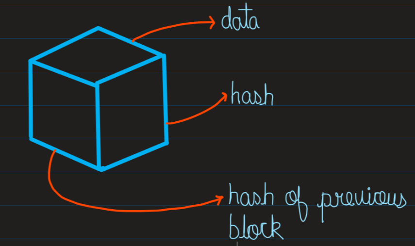
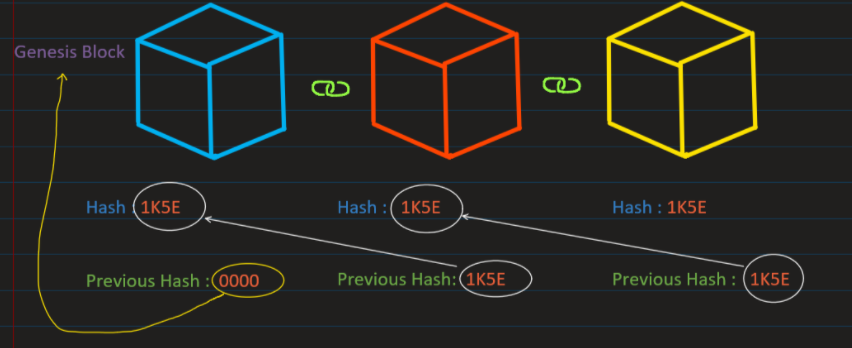
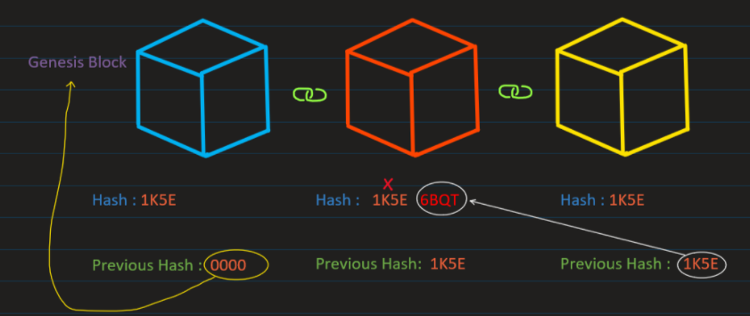

<strong style="color:#61DAFB"></strong>

<strong style="color:#61DAFB">Blockchains</strong> are incredibly popular these days. But you must be wondering what is blockchain how does it work what all problems can be solved?
As the name indicates, a blockchain is a chain of blocks that contains information. 
Blockchain technology was first outlined in 1991 by Stuart Haber and W. Scott Stornetta, 
two researchers who wanted to implement a system where document timestamps could not be tampered with.

However, this technology went mostly unused until was adapted by <strong style="color:#eb5e28">Satoshi Nakamoto</strong> in 2009 to create digital cryptocurrency i.e Bitcoin.

Blockchain is a technique to store data in a <strong style="color:#61DAFB">Decentralized</strong> manner.  Decentralized means that there will no central authority to control the entire data and information.
A centralized system is a norm today which means a single company or entity owns a platform and the users have to connect to that company’s servers to use this which means fundamentally your account is yours at all it’s their property and you were granted access in return for giving them your data. 

Cryptocurrency like Bitcoin is decentralized which means there is no central authority to control Bitcoin. It is because Bitcoin is based on Blockchain Technology which helps to make Bitcoin decentralized.

Blockchain is <strong style="color:#ff70a6">distributed ledger</strong> which is completely open to anyone. Distributed ledgers use independent computers (referred to as nodes) to record, share and synchronize transactions in their respective electronic ledgers (instead of keeping data centralized as in a traditional ledger).
They have some interesting property like if once data has been recorded inside a blockchain, it becomes very difficult to change it. Let’s understand how does it work. Each block consist of some <strong style="color:#61DAFB">data</strong>, <strong style="color:#fcec5d">a hash of the block</strong>
, and <strong style="color:#ffa987">a hash of the previous block</strong>.
Data that is stored inside a block depends on the type of blockchain. The Bitcoin blockchain for instance stores the details about a transaction, such as a sender, receiver, and amount of coins.

A block also has a Hash you can compare it to a fingerprint. It identifies the block and all its contents and the hash is always unique, just like a fingerprint. Once a block is created, it’s hash is being calculated. Changing something inside the block will cause the hash to change s well. Hashes are very useful when you want to detect changes to block. If the fingerprint of the block changes it no longer is the same block.
The third element inside each block is the hash of the previous block and this effectively creates a chain of blocks and this technique that makes a blockchain so secure. 

Here we have chain of 3 blocks and you can see that each block has the hash and the hash of previous block. The 3rd block points to 2nd block and 2nd block  points to 1st block. Now the 1st block is the special block because it can’t point to previous block as its the 1st one. We call this block as the <strong style="color:#61DAFB">Genesis block</strong>. 

Now let’s say you changed the data of the 2nd block it will cause the hash to change as well. In turn, it will make 3rd block and all the following block invalid because they no longer store a valid hash of the previous block. So changing a single block will make the following block invalid.
But just using hashes is not enough as computers these days are powerful and fast enough and can easily calculate 100’s and 1000’s of hashes every second. And you can easily tamper with the block and re-calculate hashes of other blocks and make your blockchain valid again.
So to reduce this risk, Blockchain has something called <strong style="color:#fcf300">Proof of Work</strong> don’t worry about it I will discuss it in brief in my upcoming blogs. So what it does is slows down the creation of new blocks. If we consider Bitcoin it takes approximately 10mins to calculate the required proof of work and add a block to the chain. So this mechanism makes it very hard to tamper with particular blocks because if you tamper with one block you’ll have to recalculate the proof of work for all the following blocks. Thus security of a blockchain comes from its creative use of hashing and proof of work mechanism.

But there is one more way that blockchain secures itself and that’s by being distributed. Blockchain uses a <strong style="color:#f26419">peer-2-peer network</strong> and anyone is allowed to join. In peer-to-peer (P2P) networking, a group of computers is linked together with equal permissions and responsibilities for processing data. If someone joins this network, he gets the full copy of the blockchain. Now let’s see what happens when someone creates a new block. The newly created block is sent to everyone in the network. Then each node verifies the block to make sure that it hasn’t been tampered with. If everything checks out, each node adds this block to their blockchain. All these nodes in this network create a general agreement like whether they agree about which blocks are valid and which aren’t. Blocks that are tampered with will be rejected by other nodes in the network. Now suppose if you want to successfully tamper with blockchain you’ll need to tamper with all the blocks on the chain, redo the proof of work and take control of more than 50% of peer-to-peer network, and only then your tampered block will be accepted by everyone. Which is quite impossible to do.  

Even Blockchains are constantly evolving. One of the recent developments is the creation of <strong style="color:#61DAFB">smart contracts</strong>. These contracts are simple programs that are to stored on the blockchain and can be used to automatically exchange coins based on certain conditions. The creation of blockchain technology piqued the interest of lots of people and it can be used for other things like storing medical records or even collecting taxes.

So now you might have a good idea of what a blockchain is how it works and what problems does it solves. 

