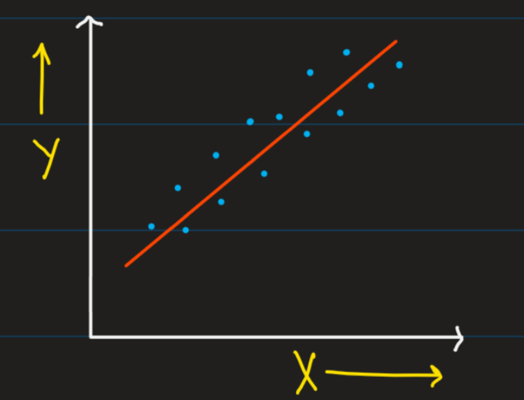
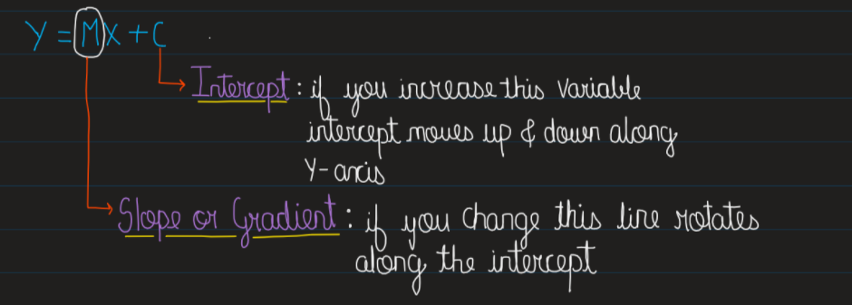
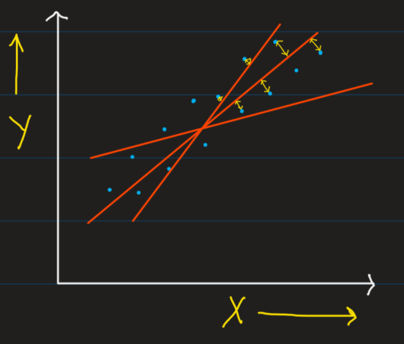
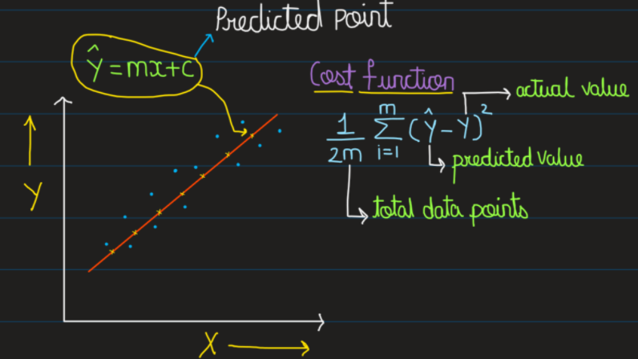

Before understanding linear regression lets understand what <strong style="color:#affc41">regression analysis</strong> is.
Regression analysis is a set of statistical methods used for the estimation of relationships between a <strong style="color:#fe5d9f">dependent variable</strong> and one or more <strong style="color:#00b2ca">independent variables.</strong>

So what exactly are independent variables and dependent variables ? For example you have been assigned with the task of finding annual sales of a company in this year. So the very first thing you will do is find out what all factors are affecting the annual sales such as for instance what are the number of employees, what are  the sales of the product, what is the profit and the loss faced etc...all these are the factors which affect the annual sales of a particular company . so all these factors that affects your annual sale are <strong style="color:#00b2ca">independent variables</strong>. And the annual sale which you want to find i.e a numeric value, a continuous value it is simply your <strong style="color:#fe5d9f">dependent variable</strong>. 

So now if you want to establish or model the relationship between dependent and independent variables then the best thing you can do is <strong style="color:#eeef20">Linear regression </strong>. And most prominently you can use regression analysis where you want the output value to be  numeric or continuous in nature

## What is Linear regression….?     

__<strong style="color:#eeef20">Linear regression </strong>attempts to model the relationship between two variables by fitting a linear or straight line to observed data.__

 So even in linear regression we have independent variables and dependent variables and the dependent variable is continuous in nature. And the relationship which we want to model between <strong style="color:#00b2ca">independent variables</strong> and <strong style="color:#fe5d9f">dependent variables</strong> is linear in nature. As you can see in this <strong style="color:#7ae582">Fig 1.1</strong>. 

 

So if we find relationship between X and Y in case of linear regression you will get linear relationship as you can see in the <strong style="color:#7ae582">Fig 1.1</strong>. The <strong style="color:#59d2fe">Blue</strong> points are nothing but your data points since you used linear data set you have to use linear model i.e <strong style="color:#fab129">Linear Regression</strong> is the best choice. 

What does <strong style="color:#fab129">Linear relationship</strong> mean ?  A linear relationship (or linear association) is a statistical term used to describe a straight-line relationship between two variables.

`Equation of a Straight line: `

The line of best fit is represented by Y= MX + C. You must be thinking how we can find the best fit line for a particular equation. One way is that we can draw multiple best fit lines as shown below in <strong style="color:#7ae582">Fig 1.3</strong> and what I should do is try to minimise this distance or error such that if I find summation (Σ) of all the errors it should be minimal. 

So whichever best fit line gives the <strong style="color:#fab129">minimal error</strong> that value will give me the slope value i.e M and some value as C which will be our intercept.

So we will use something called the <strong style="color:#72efdd">Cost funcion</strong> while we define the best fit line. The cost function returns the error between predicted outcomes compared with the actual outcomes. In order to minimize cost function we will use something called as <strong style="color:#fab129"> Gradient descent</strong> which i will talk about in upcoming blogs.

In he next blog we'll look on some hands on working and usage of <strong style="color:#fe5d9f">linear regression model</strong> so stay tuned. 
